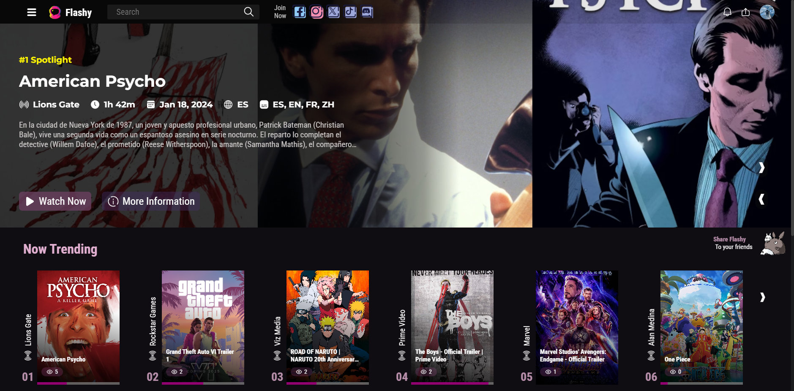

# Flashy - The Ultimate Multimedia Sharing Platform



**Flashy** is a dynamic multimedia platform that allows users to upload, stream, and interact with videos. Whether you're looking to share your latest creations or explore videos from other users, **Flashy** offers a full-featured experience. With options for both public and private content, **Flashy** provides robust tools for video sharing, playlist creation, and user interaction.

## Features

### 1. **User Authentication and Security**

- Secure user authentication powered by **JWT**.
- Email verification and password recovery managed via **Nodemailer**.
- Privacy options to make videos and playlists public or private.
- User can also sign in using google or facebook authentication provided by **Firebase**.

### 2. **Video Upload and Processing**

- Upload videos in multiple formats.
- Videos are processed with **FFmpeg** for optimal performance and compression.
- Stream videos efficiently using **MUX** for high-quality playback on any device.
- Subtitles can be uploaded and stored in **Cloudinary** for easy access and management.

### 3. **Content Management and Interaction**

- Like, dislike, and comment on videos.
- Share videos with friends or on social media.
- Create and manage public or private playlists.
- Follow channels to get updates on new content.
- Receive real-time notifications on new uploads or interactions via **WebSockets**.

### 4. **Subscriptions and Live Notifications**

- **Channel Subscriptions**: Users can subscribe to their favorite channels to receive updates on new content.
- **Live Notifications**: Get notified instantly when your subscribed channels upload new videos, or when there are comments or interactions on your content, powered by **WebSocket** connections.

### 5. **Advanced Search and Discovery**

- Search for videos, channels, or playlists using advanced filters and keywords.
- Discover trending videos, popular playlists, and top channels.
- Personalized video recommendations based on your viewing history and preferences.

### 6. **Seamless Video Streaming**

- Adaptive streaming powered by **MUX** ensures videos are played with the best possible quality based on device and network conditions.
- Support for HD and 4K streaming.

### 7. **User Channels and Playlists**

- Users can create their own channels to upload and organize content.
- Build custom playlists and share them publicly or keep them private.
- Discover and follow other users' playlists and channels for curated content.

## Technology Stack

- **Frontend**: React Vite
- **Backend**: Node.js (Express)
- **Database**: MongoDB with Mongoose
- **Video Processing**: FFmpeg (Video encoding and processing)
- **Video Streaming**: MUX (For adaptive streaming)
- **Subtitle Storage**: Cloudinary (For subtitle storage and management)
- **Image Storage**: Firebase (For storing images such as profile pictures, thumbnails, etc.)
- **Authentication**: JWT (JSON Web Tokens for secure authentication)
- **Email Service**: Nodemailer (For email verification and password recovery)
- **State Management**: Redux (For managing user states, likes/dislikes, and video playback progress)
- **WebSockets**: Real-time notifications using WebSocket connections
- **Storage**: Firebase (For image assets), Cloudinary (For subtitles), MUX (For videos)
- **Extenal Authenticaction**: Firebase (For authentication)

## How It Works

1. **User Registration and Authentication**

   - Users can sign up using email, with **JWT** used for authentication.
   - Email verification and password recovery are handled using **Nodemailer**.

2. **Video Uploading and Processing**

   - Videos uploaded by users are processed using **FFmpeg** to ensure proper format and resolution.
   - **MUX** handles video streaming, ensuring optimal playback quality.

3. **Video Streaming**

   - Stream videos on-demand with adaptive bitrate streaming via **MUX**, ensuring smooth playback on any device or network.

4. **User Interaction**

   - Users can comment on videos, like/dislike them, and share content.
   - Follow other users’ channels to receive real-time notifications on new uploads.
   - Subscribed users receive instant notifications about new interactions via **WebSockets**.

5. **Playlist Management**

   - Create and manage public or private playlists.
   - Share playlists or keep them private for personal viewing.

6. **Subscriptions and Notifications**
   - Subscribe to your favorite channels to get real-time updates on new uploads.
   - Notifications for comments, likes, and interactions on your videos will be delivered instantly using **WebSocket** technology.

## Getting Started

### Prerequisites

- **Node.js** and **npm** installed
- **MongoDB** installed and running locally or accessible via cloud (MongoDB Atlas)
- **FFmpeg** installed for video processing
- **MUX** account for video streaming API
- **Cloudinary** account for subtitle storage
- **Firebase** project for image storage

### Installation

1. Clone the repository:

   ```bash
   git clone https://github.com/AlanNin/Flashy.git
   ```

2. Navigate to the project back-end directory:

   ```bash
   cd Back-End
   ```

3. Install dependencies:

   ```bash
   npm install
   ```

4. Set up the environment variables in a `.env` file on the back-end directory:

   ```plaintext
   # PORT BACK-END
   PORT=<your_backend_port>

   # MONGO DB CONNECTION
   Mongo=<your_mongodb_connection_string>

   # JWT ENCRYPTION
   JWT=<your_jwt_secret>

   # NODEMAILER ACCOUNT CONNECTION
   EMAIL_USER=<your_email_for_nodemailer>
   EMAIL_PASSWORD=<your_email_password_for_nodemailer>
   APP_URL=<your_application_url>

   # MUX
   MuxAccessToken=<your_mux_access_token>
   MuxSecret=<your_mux_secret>

   # Cloudinary
   CloudinaryCloudName=<your_cloudinary_cloud_name>
   CloudinaryApiKey=<your_cloudinary_api_key>
   CloudinaryApiSecret=<your_cloudinary_api_secret>
   ```

5. Set up the environment variables in a `.env` file on the front-end directory:

   ```plaintext
   SKIP_PREFLIGHT_CHECK=true
   ```

6. Start the development server back-end:

   ```bash
   npm start
   ```

7. Navigate to the project front-end directory:

   ```bash
   cd Front-End
   ```

   ```bash
   react-finalproject
   ```

8. Start the development server front-end:

   ```bash
   npm start
   ```

9. Open the application in your browser:
   - Navigate to `http://localhost:3000` to start using Flashy.

## Future Features

- **Live Streaming**: Enable users to live stream videos to their audience.
- **Monetization**: Allow creators to monetize their content through subscriptions or ad revenue.
- **Video Editing Tools**: Add video editing functionality for creators to trim and enhance their videos.
- **Advanced Analytics**: Provide video creators with insights into viewership, engagement, and performance.
- **Multi-language Subtitles**: Allow multiple subtitle tracks for international viewers.
- **Video Downloading**: Enable users to download videos for offline viewing.

## Contact

For any inquiries, feel free to reach me out at [alanbusinessnin@gmail.com](alanbusinessnin@gmail.com).
